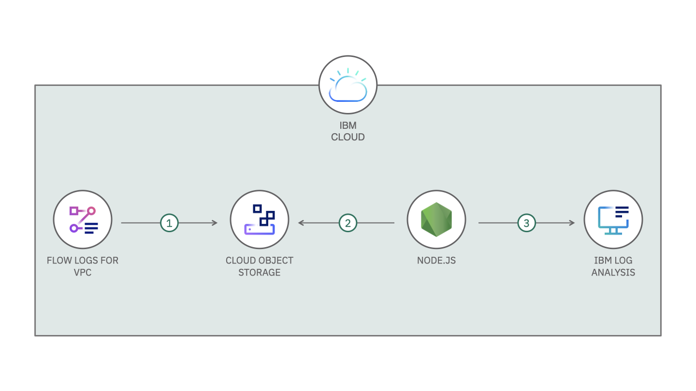

# IBM Cloud Flow Logs for VPC to IBM Log Analysis

[](https://cloud.ibm.com)
[](https://developer.ibm.com/technologies/node-js/)
[](https://github.com/IBM/flow-logs-logdna/blob/master/LICENSE)
[](https://github.com/IBM/flow-logs-logdna/pulls)

[IBM Cloud® Flow Logs for VPC](https://cloud.ibm.com/catalog/services/is.flow-log-collector) enable the collection, storage, and presentation of information about the Internet Protocol (IP) traffic going to and from network interfaces within your Virtual Private Cloud (VPC). The service stores collector output in a bucket on [IBM Cloud Object Storage (COS)](https://cloud.ibm.com/catalog/services/cloud-object-storage) - at least 1 log package (on a `.gz` file). For those logs, there is a service called [IBM Log Analysis with LogDNA](https://cloud.ibm.com/catalog/services/ibm-log-analysis-with-logdna) that can receive all logs and display them in a single platform (you can send logs from your Kubernetes cluster, VMs, etc). To import all logs into LogDNA, you need to set up a Serverless function on IBM Cloud Functions which uses a Trigger to call your function automatically. The Trigger listens for a write event on IBM Cloud Object Storage. Whenever Flow Logs for VPC stores a new object into your IBM Cloud Object Storage bucket, the Trigger calls your function that process the log package and automatcally send it to your LogDNA instance.



Before you follow step-by-step below, you need to install [IBM Cloud CLI](https://cloud.ibm.com/docs/cli/reference/ibmcloud/download_cli.html#install_use) and [IBM Cloud Functions CLI](https://cloud.ibm.com/openwhisk/learn/cli) in your local machine. Then, you need to login in your IBM Cloud account on IBM Cloud CLI (if you haven't already done, run `ibmcloud login`).

## 1. Clone this repository

Download the source code from Github and access the project folder.

```sh
git clone https://github.com/IBM/flow-logs-logdna.git
cd flow-logs-logdna
```

## 2. Create an IBM Cloud Object Storage service instance

Access the IBM Cloud Catalog and create a [IBM Cloud Object Storage](https://cloud.ibm.com/catalog/services/cloud-object-storage). After you create the instance, you have to create two Buckets with the same Resiliency and Location (e.g `Regional` and `us-south`):

- To receive the log files from CIS;
- To store the log files after you send the content to LogDNA.

Remember the name for each one of the Bucket name, because you're going to use them in the next step.

For your service instance, you need to create a Service credential. You can find it on the left menu in your COS instance. For the purpose of this project, you will use `apikey` and `iam_serviceid_crn`.

> You can find the Endpoint URL on `Endpoints` tab. The correct enpoint for your usecase depends on the Resilience and Location you choose when you create your Buckets. For more information, access the [IBM Cloud Docs](https://cloud.ibm.com/docs/cloud-object-storage?topic=cloud-object-storage-endpoints).

## 3. Create a IBM Log Analysis with LogDNA service instance

Access the IBM Cloud Catalog and create a [IBM Log Analysis with LogDNA](https://cloud.ibm.com/catalog/services/ibm-log-analysis-with-logdna). After you create the instance, you have to access the service by clicking on `View LogDNA` button.

Access the `Settings` -> `ORGANIZATION` -> `API Keys` to get your Ingestion Keys.

## 4. Set up the environment variables to deploy them as function's parameters

Run the following command with the IBM Cloud Object Storage credentials and the bucket name (for long-term retention), and IBM Log Analysis with LogDNA ingestion key:

- LOGDNA_HOSTNAME is the name of the source of the log line.
- LOGDNA_INGESTION_KEY is used to connect the Node.js function to the LogDNA instance.
- COS_BUCKET_ARCHIVE is the bucket where you will save the log package after you send it to LogDNA (consider it as your long-term retention).
- COS_APIKEY is the apikey field, generated on service credentials in your COS instance.
- COS_ENDPOINT is the endpoint available on Endpoint section in your COS instance. It depends on the resiliency and location that your bucket is defined.
- COS_INSTANCEID is the resource_instance_id field, generated on service credentials in your COS instance.

```sh
export LOGDNA_HOSTNAME="" \
  LOGDNA_INGESTION_KEY="" \
  COS_BUCKET_ARCHIVE="" \
  COS_APIKEY="" \
  COS_ENDPOINT="" \
  COS_INSTANCEID=""
```

## 5. Deploy the Action

Run the following command to deploy `handler.js` function and to set up the Trigger with Cron job.

> As you are using IBM Cloud Functions, you don't need to install any package or setup a `package.json`. The platform already has all libraries required to run the source code.

```sh
ibmcloud fn deploy --manifest manifest.yml
```

### 6. Set up the Cloud Object Storage Trigger on IBM Cloud Functions

Before you can create a trigger to listen for bucket change events, you must assign the Notifications Manager role to your IBM Cloud Functions namespace. Folow the instruction on [IBM Cloud Docs](https://cloud.ibm.com/docs/openwhisk?topic=openwhisk-pkg_obstorage#pkg_obstorage_auth) to assign the role in your service policy.

When you complete the previous step, you will be able to create a new COS Trigger. Access the [Functions > Create > Trigger > Cloud Object Storage](https://cloud.ibm.com/functions/create/trigger/cloud-object-storage) to create and connect your bucket with your Action.

Now, your Action will be called everytime you upload a new object to your bucket.

## API Reference

- [IBM Cloud Object Storage AWS.S3](https://ibm.github.io/ibm-cos-sdk-js/AWS/S3.html)

## Troubleshooting

- LogDNA ingestion API has a limitation of 10 MB per request.
- **_ESOCKETTIMEDOUT_**, **_ECONNRESET_** and **_ETIMEDOUT_** are LogDNA Ingest API errors. The script will automatically resend the logs.

## LICENSE

Copyright 2021 IBM Corp.

Licensed under the Apache License, Version 2.0 (the "License");
you may not use this file except in compliance with the License.
You may obtain a copy of the License at

    http://www.apache.org/licenses/LICENSE-2.0

Unless required by applicable law or agreed to in writing, software
distributed under the License is distributed on an "AS IS" BASIS,
WITHOUT WARRANTIES OR CONDITIONS OF ANY KIND, either express or implied.
See the License for the specific language governing permissions and
limitations under the License.
